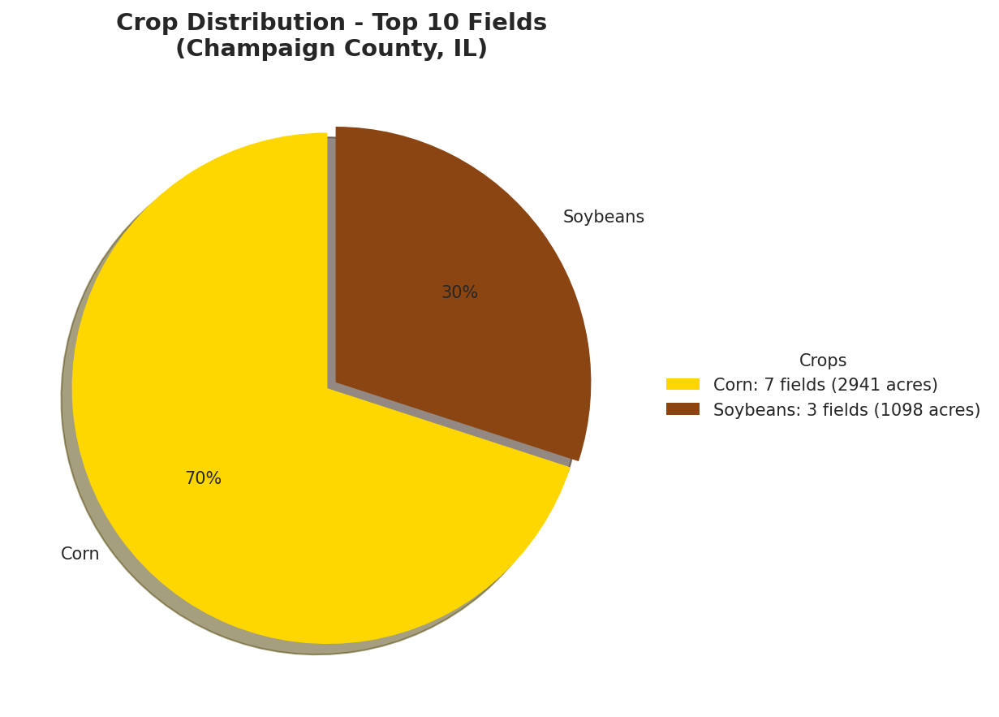
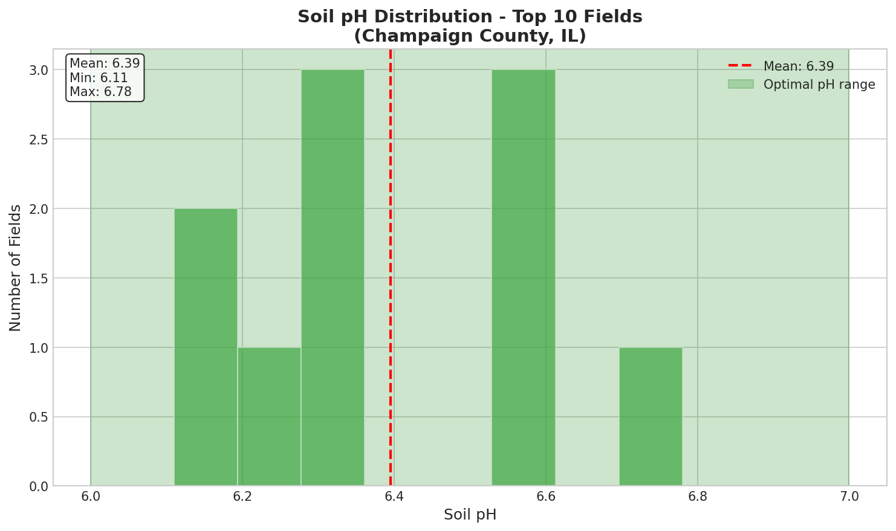
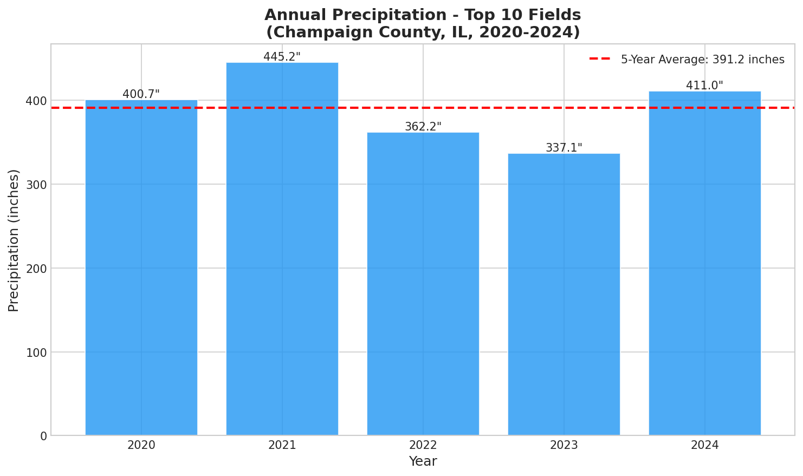
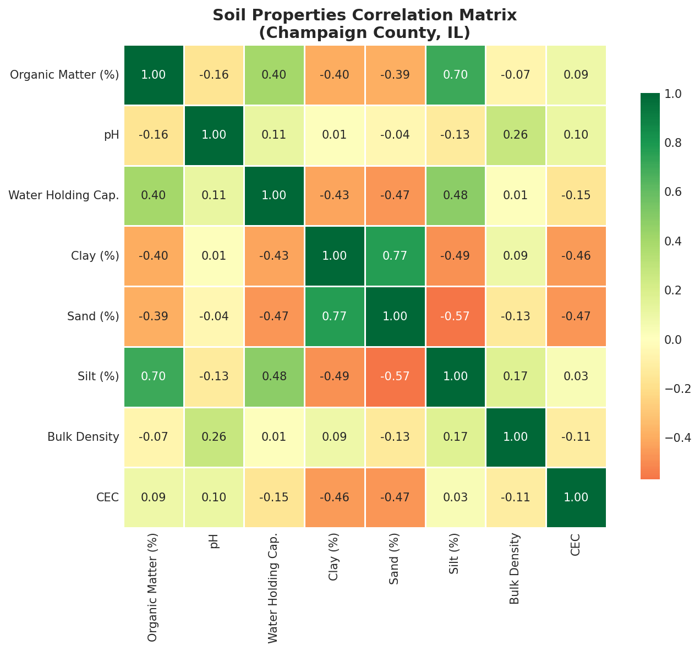

# Agricultural Field Analysis Report

**Champaign County, Illinois**

*Report Generated: March 10, 2026*

---

## Executive Summary

This report provides a practical overview of agricultural conditions for the top 10 fields near Champaign, IL. The analysis covers field characteristics, soil properties, and weather patterns to help farmers and ranchers make informed decisions.

**Key Findings:**
- 4039 total acres analyzed across 10 fields
- Soil pH averages 6.39 — within optimal range for corn and soybeans
- Organic matter averages 3.7% — indicating good soil health
- Average annual precipitation: 39.1 inches

---

## 1. Field Overview

The analyzed fields are planted primarily to corn:

| Crop | Fields | Total Acres | Percentage |
|------|--------|-------------|------------|
| Corn | 7 | 2941 | 73% |
| Soybeans | 3 | 1098 | 27% |

- **Average field size:** 404 acres
- **Largest field:** 604 acres
- **Smallest field:** 309 acres

---

## 2. Soil Analysis

### pH Levels

Soil pH is critical for nutrient availability:

- **Average pH:** 6.39 (optimal range for corn/soybeans: 6.0-7.0)
- **Range:** 6.11 - 6.78

**Recommendation:** Current pH levels are ideal. Regular testing is recommended to maintain levels.

### Organic Matter

Organic matter improves water retention and soil structure:

- **Average:** 3.7%
- **Range:** 2.7% - 4.4%

**Recommendation:** High organic matter levels support healthy crop production. Continue practices that maintain or improve OM.

### Drainage

| Drainage Class | Fields | Percentage |
|----------------|--------|------------|
| Well drained | 8 | 80% |
| Moderately well drained | 2 | 20% |

---

## 3. Weather Patterns

### 5-Year Summary (2020-2024)

| Metric | Value |
|--------|-------|
| Average Annual Precipitation | 39.1 inches |
| Average Temperature | 53.6°F |

### Annual Precipitation

| Year | Precipitation (inches) |
|------|----------------------|
| 2020 | 40.1" |
| 2021 | 44.5" |
| 2022 | 36.2" |
| 2023 | 33.7" |
| 2024 | 41.1" |

**Note:** Champaign County typically receives ~38 inches of annual precipitation. The analyzed period shows near-normal to slightly above-normal precipitation.

---

## 4. Soil Correlations

Key soil property relationships:
- **Clay and CEC:** Higher clay content correlates with higher cation exchange capacity
- **pH and Organic Matter:** Slight positive correlation between OM and pH
- **Bulk Density and Water Holding:** Inverse relationship as expected

---

## 5. Interactive Map

An interactive map of all analyzed fields is available:

📍 **[View Field Map](./figures/field_map.html)**

The map shows:
- Field boundaries
- Current crop type
- Soil pH values
- Organic matter percentages
- Click on any field for detailed information

---

## 6. Practical Recommendations

Based on this analysis:

1. **Soil Health:** Continue current practices. Organic matter levels are excellent at 3.7%.

2. **pH Management:** Monitor pH annually. Current levels at 6.39 are optimal.

3. **Water Management:** Fields show good drainage characteristics. Consider tile drainage for fields with moderate drainage.

4. **Crop Rotation:** Consider rotating corn with soybeans to:
   - Break pest and disease cycles
   - Improve soil nitrogen levels
   - Diversify income sources

5. **Planning:** Use the precipitation data to plan irrigation needs and planting schedules.

---

## Data Sources

- **Field Boundaries:** USDA Crop Sequence Boundaries
- **Soil Data:** USDA NRCS SSURGO (Soil Data Access API)
- **Weather Data:** NASA POWER (Prediction Of Worldwide Energy Resources)
- **Crop Data:** USDA NASS Cropland Data Layer (CDL)

---

## Technical Notes

- Analysis performed on top 10 fields by area
- Crop codes verified against USDA CDL standard (Code 1 = Corn, Code 5 = Soybeans)
- All scripts and data outputs saved in `/data/EDA/` for reproducibility

---

*Report generated using Python data analysis pipeline. All source code and data are available in the project repository.*
